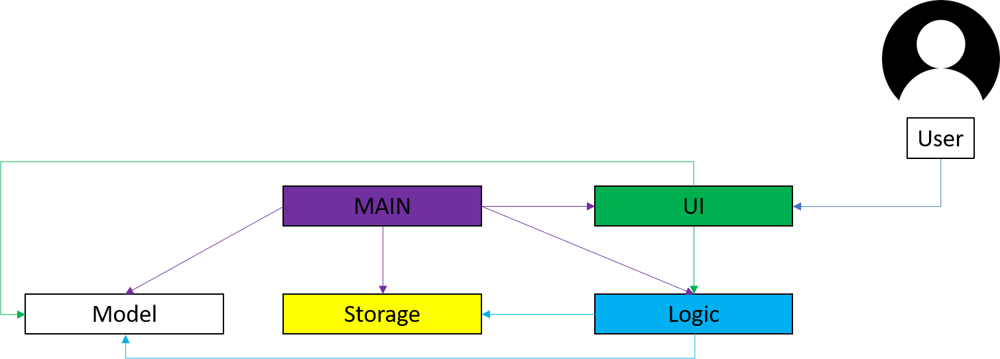
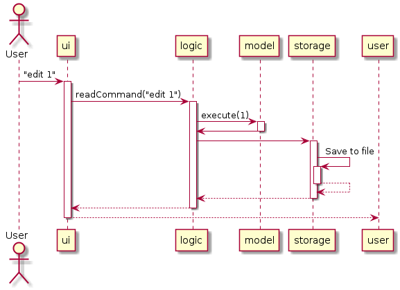
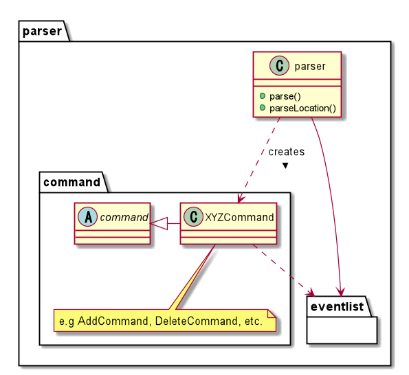
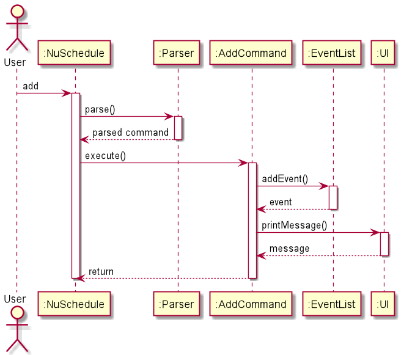

# Developer Guide

## Table of Contents
1. [Introduction](#1-introduction)
2. [Getting Started](#2-getting-started) 
2.1 [Prerequisites](#21-prerequisites) 
2.2 [Setting Up](#22-setting-up) 
3. [Design](#3-design)  
3.1 [Architecture](#31-architecture)  
3.2 [UI](#32-ui)  
3.3 [Storage](#33-storage)  
3.4 [Logic](#34-logic)  
3.5 [Model](#35-model)  
3.6 [Location](#36-location)  
4. [Implementation](#4-implementation)  
4.1 [Add events](#41-add-events)  
4.2 [Clear events](#42-clear-events)  
4.3 [Edit events](#43-edit-events)  
4.4 [Locate](#44-locate)   
4.5 [Reminders](#45-reminders)  
4.6 [Sort events](#46-sort-events)  
4.7 [View events](#47-view-events)  
5. [Documentation](#5-documentation)  
5.1 [Product scope](#51-product-scope)  
5.2 [Value Proposition](#52-value-proposition)  
5.3 [User Stories](#53-user-stories) 

## 1. Introduction
NUSchedule is a Command-Line based application that manages all of your commitments. Built with a clean and intuitive
interface, NUSchedule will help you manage your commitments without any hassle. If you are a proficient in typing, 
NUSchedule will prove itself to be the most efficient way to manage your commitments.  
  
This developer guide provides information on the architecture and design of the application, NUSchedule. This guide
provides information that will not only help you get started as a NUSchedule contributor, but that you will find useful
to refer to even if you are already a contributor.

## 2. Getting Started
This section provides information to help you get NUSchedule up and running on your own computers.

### 2.1 Prerequisites
1. JDK 11
2. Intellij IDEA

### 2.2 Setting Up
1. Fork [this repo](https://github.com/AY2021S1-CS2113T-F14-4/tp), and clone the fork onto your computer.   
2. Open IntelliJ (if you are not in the welcome screen, click File > Close Project
to close the existing project dialog 
first).   
3. Set up the correct JDK version for Gradle  
    1. Click Configure > Project Defaults > Project Structure
    2. Click New… and set it to the directory of the JDK.
4. Click Import Project (or Open or Import in newer version of Intellij).
5. Locate the build.gradle file (not the root folder as you would do in a normal importing) and select it. Click OK.
   If asked, choose to Open as Project (not Open as File).
6. Click OK to accept the default settings but do ensure that the selected version of Gradle JVM matches the JDK 
   being used for the project.

## 3. Design
This section describes the different components of the application and how each component interact with
each other to run the program. 

### 3.1 Architecture

The Architecture Diagram above provides a high-level view of the design of NUSchedule. The app can be broken down into 
5 different components:  
1. Main: Initializes the other components and connects them with each other.
2. UI: Manages the User Interface that the user interacts with.
3. Logic: Interprets user commands.
4. Storage: Reads data from and writes data to the hard disk.
5. Model: Stores the data the app uses in memory.

__How the architecture components interact with each other__  
The sequence diagram below shows how each individual component interacts with each other when the user inputs a command.

### 3.2 UI

*Figure 3.2.1 Class diagram for UI component*

 __API__:`UI.java`  
The UI consists of various parts, e.g. `printGreetingMessage`, `printEventList`, `showError`, `printNumEvent`, etc.
 
The `UI` component reads user input using readCommand() and executes user commands according to the Logic component.

### 3.3 Storage
__API__:`Storage.java`
The `Storage` component can save the list of event data in .txt format and read it back.   
### 3.4 Logic
__API__:`Parser.java`  

*Figure 3.4.1 Class diagram for Logic component*

The `logic` component parses the user input and executes commands based on the given input.
 1.	Parser reads the user input and returns a command to be executed by `NuSchedule`.
 2.	The command execution affects the EventList (e.g. clearing the list).
 3.	The result passes back to the UI, which then displays relevant feedback to the user.  

### 3.5 Model
__API__:`EventList.java`   
The `Model` component stores an ArrayList, events, that represents the current list of events.

### 3.6 Location

*Figure 3.6.1 Class diagram for location component*

__API:__ `LocationList.java`  

The `LocationList` is made up of an ArrayList of Locations, which is a type of variable that stores different information 
for different types of location (eg. `Building`, `Hostel`, etc.). However, do note that any place that is 
not within the list of saved locations will be saved as type `OutOfNUS`, and would not be saved into the `location.txt` 
file. The location will still be part of the location list before the app closes, and it will also be 
saved as part of the Event information.

 There is a separate api for bus stops (`BusStopList.java`), which stores all available bus stops 
and their information. Although the variable is declared in the main NUScheule class, it is only referenced 
and not edited in any part of the program.

 The `Location` component 
* stores information about various types of locations 
* prints the list of locations that is saved in the data file 
* checks if a location is saved in the list and returns the location when asked

## 4. Implementation
This section describes the implementation of some noteworthy features. 

### 4.1 Add events
This feature allows users to add events and relevant information about them (description, time and location) to the list
. There are three possible types of events that can be added: classes, assignments, and personal events.

Given below is an example usage scenario:

Step 1. The user launches the application to add a class to his schedule. The user executes 
`class CS1010 Lecture /t 2020-05-05 10:00 /l LT27` to add a new class to the list.  

Step 2. The Parser class parses the input as a new class with description ‘CS1010 Lecture’, time ‘2020-05-05 at 10:00’, 
and location ‘LT27’.  

Step 3. `addCommand()` is then called with the above parameters, and adds it to the list of events, events.

The sequence diagram below shows the process of adding a new event.

*Figure 4.1.1 Sequence Diagram for add function*

### 4.2 Clear events
This feature allows users to completely delete the existing event information that is previously typed in by users. 

Given below is an example usage scenario:

Step 1. The user launches the application and wants to delete everything previously stored by using `clear` command.  

Step 2. If there is no information stored before the user input the `clear` command, the user will be reminded about 
that the list is already empty. 
 
### 4.3 Edit events
This feature allows users to edit the information of events that was previously added. 

Given below is an example usage scenario:

Step 1. The user launches the application and inputs a command to add one event.  

Step 2. The user realises that there was a mistake in the event added and decides to edit the task information using the 
edit 1 command to edit the event that was added (index = 1 as it is the one and only event currently).  

Step 3. The Parser class parses the 'edit 1' command. The user enters a new event.  

Step 4. 'editCommand()' function replaces the original event with the edited one. 

### 4.4 Locate
This feature allows users to add locations as part of the event information. If the place is located within the school, 
additional information about the location will be provided such as nearest bus stops or buildings. If the place is a 
bus stop, the buses available will be provided instead. The user will add location name as the last piece of information 
when adding an event. The LocationList has a method that searches for the place with the exact same name, if such a 
place is not found, it will create a location and allocate it to be OutOfNUS.  

This feature also allows users to search for a location based on a given location name, or the location where an event 
is held. It will print out additional information about the location to the user. 

The `locate` command executes with the following steps: 
  
Step 1. When the user type in `locate [input]`, the Parser class will extract the input from the command and call a 
`LocateCommand` object.  
* `input` will always be a String when passed into the command object. 

Step 2. `LocateCommand` will then try to convert the input into an integer, if possible.  

Step 3. If conversion is possible, the method will obtain the event at the given index and return its location 
information.  
* Tries to catch `IndexOutOfBoundException` to check if the given index is within the range of the
event list.

Step 4. If conversion is not possible, then it will check if the given string is a valid location.  
* Returns the location if valid
* Prints an error message if invalid   

The sequence diagram below shows exactly which methods, from which classes, are called to obtain the required location. 

*Figure 4.4.1 Sequence diagram for locate function*

### 4.5 Reminders

### 4.6 Sort events

### 4.7 View events

## 5. Documentation

### 5.1 Product scope
__Target user profile:__
* NUS student or staff
* able to type quickly
* has quite a number of events to keep track of  
* prefers to use desktop apps
* prefers using Command Line Interface (CLI) apps
* prefers typing instead of mouse interactions

### 5.2 Value proposition

{Describe the value proposition: what problem does it solve?}

### 5.3 User Stories

|Version| As a ... | I want to ... | So that I can ...|
|--------|----------|---------------|------------------|
|1.0|busy individual|keep track of both personal and school activities|avoid clashing events
|1.0|freshman|know module details and lesson venues|be on time for my activities
|1.0|forgetful person|be reminded of the deadlines for my assignments|submit on time
|1.0|tutor|know the estimated time for my students to travel to their next class|pace my lesson suitably
|1.0|hardworking student|track how much time I have spent studying\allocate my time efficiently
|2.0|exchange student|know the optimal path to reach my next destination|avoid getting lost
|2.0|user|find a to-do item by name|locate a to-do without having to go through the entire list|
|2.0|professor|Know whether my students have another lesson after mine and the expected time of travelling|Pace my lesson appropriately
## Non-Functional Requirements

{Give non-functional requirements}

## Glossary

* *glossary item* - Definition

## Instructions for manual testing

{Give instructions on how to do a manual product testing e.g., how to load sample data to be used for testing}
