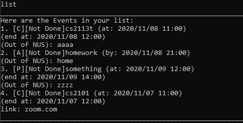
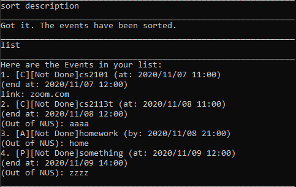
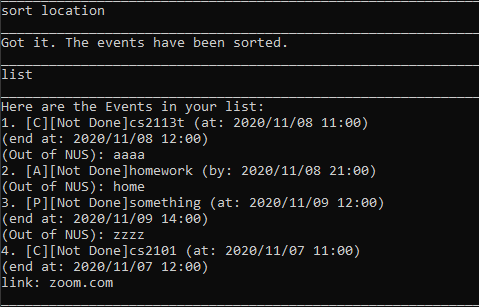
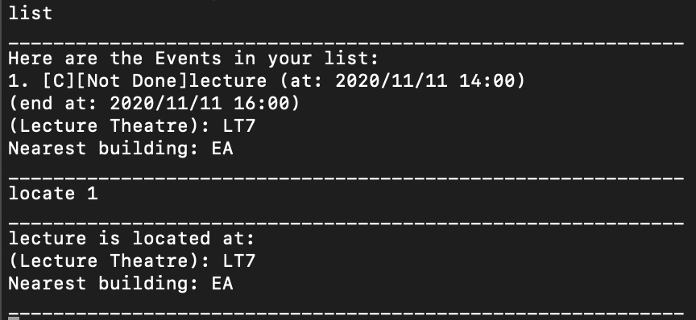
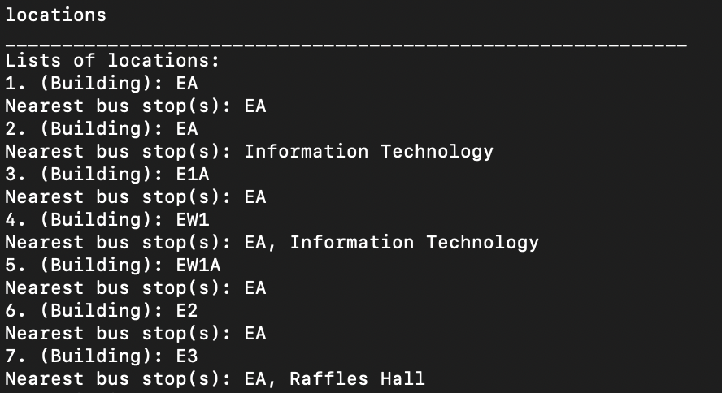
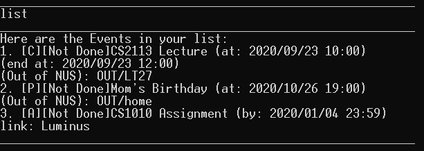
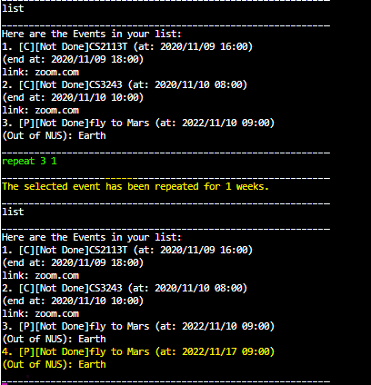
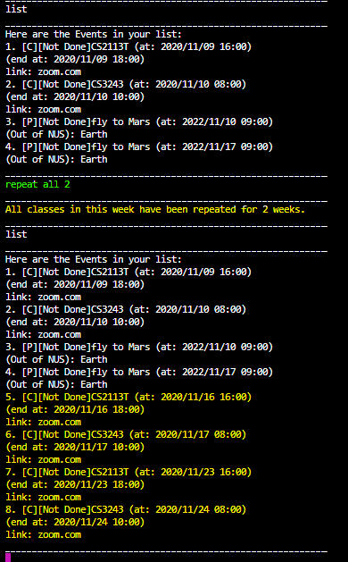
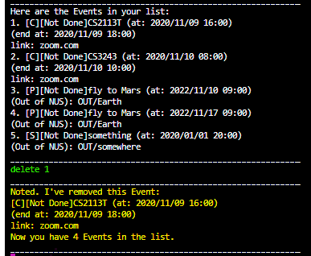

# User Guide

Yang Jiaqi

Zhuang Mengjin

Xu Che

Wu Nan

Wan Shi Jie Brendan

## Introduction

NUSchedule is a straightforward yet sophisticated application that helps you manage your events. It allows you 
 to keep track of not only your school events or activities (eg. lectures, tutorials, assignments), but 
also your personal activities. It utilises a command line interface (CLI), which accepts user input in the form of text. 
This gives the application both simplicity and speed, setting it apart from other apps such as NUSMods and Luminus. 

* [Quick Start](#quick-start)
* [Features](#features)
    * [View available commands](#view-available-commands)
    * [Add an event](#add-an-event)
    * [Edit an event](#edit-an-event)
    * [Sort events](#sort-events)
    * [Find a location](#find-a-location)
    * [List all locations](#list-all-locations)
    * [List all events](#list-all-events)
    * [Clear events](#clear-events)
    * [Mark event as done](#mark-event-as-done)
    * [Reminder of deadlines](#reminder-of-deadlines)
    * [Repeat of events](#repeat-of-events)
    * [Delete an event](#delete-an-event)
    * [Find a keyword](#find-a-keyword)
    * [Find a date](#find-a-date)
    * [Find locations exist in a certain group](#find-locations-exist-in-a-certain-group)
    * [Keep track on the study time](#keep-track-on-the-study-time)
    * [Make the app know you](#make-the-app-know-you)
    * [Exit the app](#exit-the-app)
* [FAQs](#FAQ)
* [Command Summary](#command-summary)

## Quick Start

1. Ensure that you have Java 11 or above installed in your Computer.
2. Download the latest `nuschedule.jar` from here.
3. Copy the file into a new folder, which will serve as the home folder for NuSchedule. 
4. Copy the latest `location.txt` and `bus_stops.txt` files into a directory named `data` in the home folder.
5. Open the command prompt and navigate to the home folder.
6. Run `nuschedule.jar` using the following command: `java -jar nuschedule.jar`

## Features 

### Tips:
In the following description, `DATE` refers to the date in the format yyyy-MM-dd. e.g. `2020-10-31` 
`TIME` refers to the time in the format HH:mm. e.g. `10:00`  

`/t` refers to the starting time for PersonalEvent and Class, and deadline for Assignment  
`/e` refers to the ending time for PersonalEvent and Class  

### View available commands

Shows list of commands and provides a link to the user guide for more details. 

Format: `help`

### Add an event

Adds events/tasks to the schedule. Can support various types of tasks:  

* PersonalEvent  
  Format:  
  `personalEvent EVENTNAME /t DATE TIME /e DATE TIME /l LOCATION` for offline events.  
  OR  
  `personalEvent EVENTNAME /t DATE TIME /e DATE TIME /o MEETING_LINK /p MEETING_PASSWORD` for online events.  
    
  Note that `/e DATE TIME` is optional. You may input a personal event without an ending time.  
  In `/e DATE TIME`, `DATE` is optional. If you enter `/e TIME`, the default date will be the same 
  as the date that the event starts.  
  For online events, `/p MEETING_PASSWORD` is optional, since not all online events require a password.

* Assignment  
  Format:  
  `assignment EVENTNAME /t DATE TIME /l LOCATION`  
  OR  
  `assignment EVENTNAME /t DATE TIME /o SUBMISSION_LINK`  

* Class  
  Format:  
  `class CLASSNAME /t DATE TIME /e DATE TIME /l LOCATION`  
  OR  
  `class CLASSNAME /t DATE TIME /e DATE TIME /o MEETING_LINK /p MEETING_PASSWORD`  
    
  Similar to personal events, in `/e DATE TIME`, `DATE` is optional. For online events,`/p MEETING_PASSWORD` is optional.  
  However, `/e DATE TIME` or `/e TIME` is required, since all classes should have an ending time. 

* SelfStudy
  Format:
   `selfStudy EVENTNAME /t DATE TIME /e DATE TIME /l LOCATION` for offline events.  
    OR  
    `selfStudy EVENTNAME /t DATE TIME /e DATE TIME /o MEETING_LINK /p MEETING_PASSWORD` for online events.  
      
    Note that `/e DATE TIME` is optional. You may input a personal event without an ending time.  
    In `/e DATE TIME`, `DATE` is optional. If you enter `/e TIME`, the default date will be the same 
    as the date that the event starts.  
    For online events, `/p MEETING_PASSWORD` is optional, since not all online events require a password.  
    
Examples of usage: 
  
`class CS2113 Lecture /t 2020-09-23 10:00 /e 12:00 /l LT27`
`personalEvent Mom’s Birthday /t 2020-10-26 19:00 /l home`
`assignment CS1010 Assignment /t 2020-01-04 23:59 /o Luminus`
`selfStudy Prepare for exam /t 2020-11-26 15:00 /l home`  

Adding a class:  
  

Adding a personal event:  
  

Adding an assignment:  
  

Adding a self study event: 
  

Adding an event with a timing clash:  

### Edit an event
The `edit` command allows you to edit the event type, description, start/end date and location for an existing 
event. You can start using this command by entering `edit INDEX`, where INDEX is the number of the task you want to
edit. 

Format: `edit INDEX`  

Example:  

Let's say you have one event stored in NuSchedule currently:  

  
Suppose you entered the timing incorrectly and would like to edit it to the correct timing. Enter the following command
to edit the event:  

 

Next, you will be prompted to enter the new values for the 5 fields which are type, description, location start and end 
date respectively. Enter your desired changes and press the `ENTER` key to go through the fields. You can leave a field 
blank and simply press enter if you do not want to make any changes.  

Expected Outcome:  

### Sort events
With this command, you can sort all events by either their end time, location or their description. When sorting by time, events
will be sorted in a chronological order. Events with an earlier end date will be sorted on top of events with later end
dates. This way, you can prioritize the events that are due soon.   

When sorting by description, the events will be sorted in alphabetical order according to their descriptions. Events 
with descriptions starting with 'a' will be sorted on top of events with descriptions starting with 'z' for example.  

When sorting by location, the events will be sorted in alphabetical order according to their location. Events with
offline locations will be sorted on top of locations with online locations.  

Format: `sort SORT_CRITERIA`  

Example: `sort description`

Before sorting:  

After sorting:  

Sort by time:  

Sort by location:  

### Find a location
With this command, you can find out about locations around NUS. Depending on the type of location, different additional 
information will be shown together with the location (e.g. nearest building, nearest bus stops). 

Format: `locate LOCATIONNAME` or `locate EVENTINDEX` 

Example: `locate lt1`

Find lecture theatres using location name: 

Find buildings using location name: 

Find locations using event index: 

### List all locations
Displays a list of all locations within NUS

Format: `locations`

Expected output: (list given here is incomplete) 

### List all events
Shows you a list of all events.  

Format: `list`  

Example Output:  

### Clear events

Delete events existing in the list, you can choose to delete all, auto delete or delete events before a certain date:

* Clear all events
  Format: `clear`
  
* Switch the autoClear function on so that events happened one month ago will be automatically cleared.
  Format: `autoClear on`
  Note that this function will clear all events which happened one month ago no matter they are done or not.  

* Switch the autoClear function off  
  Format: `autoClear off`

* Clear events happened before a certain date
  Format: `clearBefore CLEAR_DATE`
  
  Example: `clearBefore 2020-03-10`
  
Example Output:  

### Mark event as done
Mark an event that has been completed with `DONE`.  
Note that the events which are not assignments, cannot be done before its ending time.

Format: `done INDEX`  

Example: `done 2`

Example Output:  
  

### Reminder of deadlines
Shows a list of all events for today's date.

Format: `reminder`

Example Output:  

### Repeat of events
Repeat the selected event for several weeks, or repeat all classes this week for several weeks.

Format: `repeat INDEX NUMBER_OF_WEEKS` OR `repeat all NUMBER_OF_WEEKS`  

Example: `repeat 3 1`, `repeat all 2`  

Example Output: 
  

### Delete an event
Delete the selected event from the list.

Format: `delete INDEX`

Example: `delete 1`  

Example Output: 

### Find a keyword
Find the events with given keyword. Note that it's case-sensitive.

Format: `find KEYWORD`  

Example: `find CS`

Example Output: 
  

### Find a date
Find the events happen on the given date.  

Format: `date yyyy-MM-dd`  

Example `date 2020-11-10`  

Example Output: 

### Find locations exist in a certain group
Find the locations in NUS that belongs to certain faculty or the hostels.

Format: `FOS` OR `FOE` OR `SOC` OR `BIZ` OR `HOSTEL` OR `SDE` OR `FASS`  

Example Output: 
  

### Keep track on the study time
Find the amount of time you spent on study on a certain date.

Format: `studyTime DATE`  

Example Output: 

### Make the app know you
Tell the app your name, and whether you are a professor or a student. Whether you indicate yourself as a professor,
 or a student, will make a difference in another function, which will come in a later version.

Format: `student NAME` OR `professor NAME`

Example Output: 
 

### Exit the app
Exit.

Format: `bye`

Example Output: 

## FAQ

**Q**: How do I transfer my data to another computer? 

**A**: Install the app in the other computer and overwrite the empty data file it creates with the file that contains 
the data of your previous AddressBook home folder.

**Q**: What if I cannot run the application, or the application suddenly stops running unexpectedly?

**A**: If you cannot run the application at the beginning, please refer back to the Quick Start section and check
whether the jar file is in the correct folder. If you cannot find what is wrong, please take a screenshot of your computer
and report it as an issue to [this link](https://github.com/AY2021S1-CS2113T-F14-4/tp/issues).

**Q**: What should I do if I cannot get the input format for adding events correctly?

**A**: For all wrong input format, there will be an error message to tell you what exactly you have input wrongly. If
the error message is not helpful, please refer back to relevant sections in Features. We recommend you to follow the 
instructions provided closely as the current version of NUSchedule has a relatively high requirement in terms of input 
accuracy. If you really cannot find what is wrong, please report it as an issue to [this link](https://github.com/AY2021S1-CS2113T-F14-4/tp/issues).

## Command Summary

|Action|Command|Example|
|------|-------|-------|
|add|`EVENTTYPE EVENTNAME /t DATE TIME` `/e DATE TIME`(optional personal event and self study, compulsory for class, must not have for assignment) `/l LOCATION` OR `/o LINK` `/p PASSWORD`(optional)|`personalEvent Mom’s Birthday /t 2020-10-26 19:00 /l home`|
|clear|`clear` OR `autoClear STATUS` OR `clearBefore CLEAR_DATE` |`clearBefore 2020-10-22`|
|delete|`delete INDEX`|`delete 1`|
|done|`done INDEX` |`done 1` |
|edit|`edit`, then fill in each fields when prompted and press `ENTER` to move on to the next field|`edit 1` `ENTER` `class` `ENTER` `cs2113t` `ENTER` `\l school` `ENTER` `2020-10-26 19:00` `ENTER` `2020-10-26 20:00`|
|help|`help`|
|list|`list`|
|locate|`locate LOCATION_NAME` OR `locate EVENT_INDEX`|`locate LT1`|
|sort|`sort SORT_CRITERIA` |`sort description`|
|reminder|`reminder`|`reminder`|
|repeat|`repeat INDEX NUMBER_OF_WEEKS` OR `repeat all NUMBER_OF_WEEKS`|`repeat all 1`|   
|find (keyword)|`find KEYWORD`|`find book`|
|find (date)|`date`|`date 2020-11-08`|
|calculate study time|`studyTime DATE`|`studyTime 2020-11-08`|
|find locations belongs to a certain group|`FACULTY` or `HOSTEL`|`FOE`,`FOS`|
|UserInfo|`student NAME` OR `professor NAME`|`student LeeJuntong`|
|exit|`bye`|`bye`|

